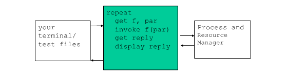

# 进程与资源管理实验
****
## 一、实验原理
&ensp;&ensp;&ensp;&ensp;

## 二、实验目的
&ensp;&ensp;&ensp;&ensp;设计和实现进程与资源管理，并完成Test shell的编写，以建立系统的进程管理、调度、资源管理和分配的知识体系，从而加深对操作系统进程调度和资源管理功能的宏观理解和微观实现技术的掌握。

## 三、实验内容
&ensp;&ensp;&ensp;&ensp;在实验室提供的软硬件环境中，设计并实现一个基本的进程与资源管理器。该管理器能够完成进程的控制，如进程创建与撤销、进程的状态转换；能够基于优先级调度算法完成进程的调度，模拟时钟中断，在同优先级进程中采用时间片轮转调度算法进行调度；能够完成资源的分配与释放，并完成进程之间的同步。该管理器同时也能完成从用户终端或者指定文件读取用户命令，通过Test shell模块完成对用户命令的解释，将用户命令转化为对进程与资源控制的具体操作，并将执行结果输出到终端或指定文件中。

## 四、实验环境
- 平台：Windows
- 语言：C++

## 五、实验步骤
### 1.系统功能分析
&ensp;&ensp;&ensp;&ensp;系统应具备以下功能：

- 驱动程序（shell）
    - 从终端或者测试文件读取命令
    - 将用户需求转换成调度内核函数（即调度进程和资源管理器）
    - 在终端或输出文件中显示结果：如当前运行的进程、错误信息等。

- 进程
    - 进程的创建
    - 进程的切换
    - 进程的删除
    - 错误检测
    - 定时器中断

- 资源管理
    - 资源的申请
    - 资源的释放

### 2. 总体架构设计
&ensp;&ensp;&ensp;&ensp;系统的总体架构图如下:



&ensp;&ensp;&ensp;&ensp;图中最右边部分为进程与资源管理器，属于操作系统内核的功能。该管理器具有如下功能：完成进程创建、撤销和进程调度；完成多单元 (multi_unit)资源的管理；完成资源的申请和释放；完成错误检测和定时器中断功能。

&ensp;&ensp;&ensp;&ensp;图中间绿色部分为驱动程序 shell, 设计与实现 shell，该 shell将调度所设计的进程与资源管理器来完成测试。

&ensp;&ensp;&ensp;&ensp;图中最左端部分为：通过终端（如键盘输入）或者测试文件来给出相应的用户命令，以及模拟硬件引起的中断

### 3.具体模块设计
&ensp;&ensp;&ensp;&ensp;这里把系统分为三个模块，分别是进程模块、TEST Shell 模块和资源模块，具体的设计细节在下面会有说明，在其中类的说明中类成员没有括号，类方法有括号

&ensp;&ensp;&ensp;&ensp;系统的大体运行流程：最开始我们先通过交互解释模块来解析输入的命令来执行相应的操作，然后便进行进程的管理（进程的创建和删除）和资源的管理（资源的申请和释放），在下面每个具体的模块设计将进行详细的设计介绍。

#### 3.1 Test shell 模块：
&ensp;&ensp;&ensp;&ensp;首先是 shell 模块的设计，此模块主要的功能是解析用户输入的指令，然后执行相应的操作。在代码中我们设计一个类来表示 shell，然后读入用户的输入来执行对应的操作。下面具体类信息和代码流程细节，其中关于进程和资源模块不做详细说明。

##### 3.1.1 模块类：
- 交互界面 shell：
    - 读入用户输入，执行相应的操作：read()

##### 3.1.2 细节说明：
###### 系统启动初始化：Shell()
&ensp;&ensp;&ensp;&ensp;通过 shell 类的构造函数进行系统的初始化，在初始化中，调用 init() 函数创建初始进程（优先级为0的系统进程）：

```c++
Shell::Shell() {
    ProcessManage::init();
    instruck = NULL;
}
```

###### 对用户输入指令进行解析执行：read(std::string input)
&ensp;&ensp;&ensp;&ensp;读入用户的输入，使用字符分割获取指令的各个部分，然后对指令进行判断（是什么指令，指令参数是否符合规范），指令正确时安装相应指令调用相应的函数：

```c++
/************************************************************************/
/* 读取用户指令进行相应操作：
    input：用户输入的指令*/
/************************************************************************/
bool Shell::read(std::string s) {
    int input = 0;

    //对输入的指令进行分割解析
    instruck = new std::vector<std::string>;
    std::string delim = " ";//分隔符为空格
    Tool::split(s, delim, instruck);

    //获取命令
    std::string command = instruck->at(0);

    //匹配的同时进行指令参数检测（是否符合标准或个数是否匹配）
    //退出系统
    if(command == "q") {
        if(instruck->size() == 1) {
            return false;
        }
    }
    //创建进程
    else if(command == "cr") {
        //判断是否参数为两个，一个进程 ID,一个进程优先级
        if(instruck->size() != 3) {
            std::cout << ">>创建进程需提供进程名和优先级，请检查输入参数" << std::endl;
            std::cout << ">>";
        }
        else {
            std::string name = instruck->at(1);
            int priority = atoi(instruck->at(2).c_str());
            ProcessManage::createProcess(name, priority);
        }
    }
    //删除进程
    else if(command == "de") {
        //判断参数是否为一个，删除进程名
        if(instruck->size() != 2) {
            std::cout << ">>删除进程需提供进程名，请检查输入参数" << std::endl;
            std::cout << ">>";
        }
        else {
            std::string name = instruck->at(1);
            ProcessManage::deleteProcess(name);
        }
    }
    //申请资源
    else if(command == "req") {
        //判断参数是否为两个，资源名和申请资源数量
        if(instruck->size() != 3) {
            std::cout << ">>申请需提供资源名和数量，请检查输入参数" << std::endl;
            std::cout << ">>";
        }
        else {
            std::string name = instruck->at(1);
            int count = atoi(instruck->at(2).c_str());
            ResourceManage::requestResource(name, count);
        }
    }
    //释放资源
    else if(command == "rel") {
        //判断参数是否为一个：资源名
        if(instruck->size() != 2) {
            std::cout << ">>释放需提供资源名，请检查输入参数" << std::endl;
            std::cout << ">>";
        }
        else {
            std::string name = instruck->at(1);
            ResourceManage::releaseResource(name);
        }
    }
    //时钟中断
    else if(command == "to") {
        if(instruck->size() != 1) {
            std::cout << ">>请检查输入，help查看指令输入帮助" << std::endl;
            std::cout << ">>";
        }
        else {
            ProcessManage::timeInt();
        }
    }
    //查看进程信息
    else if(command == "list_p") {
        if(instruck->size() != 1) {
            std::cout << ">>请检查输入，help查看指令输入帮助" << std::endl;
            std::cout << ">>";
        }
        else {
            ProcessManage::listProcess();
        }
    }
    //查看系统资源信息
    else if(command == "list_r") {
        if(instruck->size() != 1) {
            std::cout << ">>请检查输入，help查看指令输入帮助" << std::endl;
            std::cout << ">>";
        }
        else {
            ResourceManage::listResource();
        }
    }
    //输入错误
    else {
        std::cout << ">>请检查输入，help查看指令输入帮助" << std::endl;
        std::cout << ">>";
    }

    //释放相应指针资源
    delete(instruck);

    return true;
}
```

#### 3.2 进程模块：
&ensp;&ensp;&ensp;&ensp;进程模块较为复杂，以下活动有几个要点需要注意：
- 进程初始化：进程初始化时系统会自动创建一个初始进程，其优先级为0，最高优先级，是后面所有进行的父进程
- 进程创建：创建一个新的进程会导致一次进程调度，重新检查进程的优先级，如果当前新建的进程的优先级比正在运行的进程的优先级高，那么当前正在运行的进程停止运行，进入就绪等待队列，新建进程运行
- 删除进程：删除一个进程，也会导致一次进程调度，因为删除一个进程后会释放相应获得的资源，而其他进程可也申请相应的资源而进入就绪队列
- 时钟中断：停止当前运行的进程，让其进入就绪等待队列，再让下一进程进入运行

&ensp;&ensp;&ensp;&ensp;进程优先级有三级，依次下降，0级只有初始化进程：0级、1级、2级

&ensp;&ensp;&ensp;&ensp;进程的状态有三种：阻塞（-1）、就绪（0）、运行（1）。阻塞是因资源无法获取；就绪是资源获取后在队列中排队等待；运行是进行正在运行，系统在同一时间只能运行一个进程

&ensp;&ensp;&ensp;&ensp;新建进程是资源获取数量为随机生成

##### 3.2.1 模块类：
- 进程管理 ProgressManage：
    - 系统进程初始化：init()
    - 创建进程：createProcess()
    - 删除进程：deleteProcess（）
    - 查看进程信息：listProcess（）
    - 时钟中断：timeInt（）

- 进程 Progress：
    - 进程名：name
    - 所需资源：resource1, resuouce2
    - 优先级：priority
    - 进程状态：state
    
- 进程控制块结构 PCB：
    - 进程：pProgress
    - 父进程：pFather
    - 子进程：pSon
    - 资源状态：sourceState

- 进程管理队列 List：
    - 0优先级：p0
    - 1优先级：p1
    - 2优先级：p2

#### 3.3 资源模块：
##### 3.3.1 模块类：
- 资源 resource：
    - 资源名：ID
    - 资源总量：amount
    - 资源剩余量：remain
    - 占用情况链表：pOccupyList

### 4.测试

## 六、实验总结